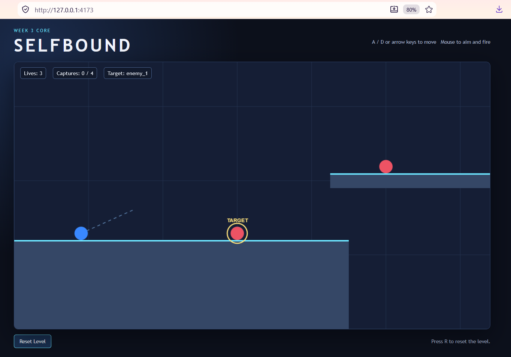

# EVIDENCE 003

## 1. Baseline Summary

### Initial Claim

The Week 3 Core should provide a small, deterministic 2D side-scroller in which the player's movement, projectile, enemy capture, green threat, reset, camera, and win conditions are all implemented within the defined scope.

### Baseline Commit / Version

Record the commit hash or equivalent version identifier here:

7d6dc17

### Run Command

Record the exact command used to start the baseline:

npm start

### Baseline Environment / Actual Output

Record the actual command output and relevant setup details. Do not paraphrase a command that was not run.

PS C:\Users\Milena\Documents\GitHub\SELFBOUND_Game> npm start

> selfbound-game@1.0.0 start
> npm run build && npm run serve

> selfbound-game@1.0.0 build
> tsc -p tsconfig.json

> selfbound-game@1.0.0 serve
> node scripts/serve.mjs

SELFBOUND running at http://127.0.0.1:4173

### Baseline Screenshot / Evidence

Record the filename or location of the preserved baseline screenshot/video:

## 2. Initial Test Status

| Check              | Expected          | Actual | Status |
| ------------------ | ----------------- | ------ | ------ |
| Application starts | Browser app loads | Yes    | PASS   |
| Game loop runs     | Animation updates | Yes    | PASS   |
| Week 3 evals       | See `EVALS.md`    | Yes    | PASS   |

## 3. Selected Problem

### 3.1. Claim:
The Week 3 test suite (tests/logic.test.ts) should compile and run cleanly both from the
command line (npm test) and inside the editor (VS Code), with no TypeScript errors.

### 3.2. Signal:
VS Code marked the imports in tests/logic.test.ts as an error:
  import assert from "node:assert/strict";
  import test from "node:test";
  -> "Cannot find name 'node:test'. Do you need to install type definitions for node?
      Try `npm i --save-dev @types/node` and then add 'node' to the types field in your
      tsconfig. ts(2591)"
At the same time, `npm test` passed (5 pass, 0 fail) and `npm start` ran without errors.
So the error appeared only in the editor, not in the CLI build.

### 3.3. Hypothesis:
The project has two TypeScript configs:
- tsconfig.json: includes only "src/**/*.ts" and sets "types": [] (no Node types);
- tsconfig.test.json: includes "tests/**/*.ts" and sets "types": ["node"].
`npm test` compiles with tsconfig.test.json, so Node types are available there.
VS Code does not know about tsconfig.test.json. For tests/logic.test.ts it falls back to
the nearest tsconfig.json, which excludes the tests folder and has no Node types, so it
reports TS2591. The code is correct; the editor uses the wrong project configuration.

### 3.4. Minimum change:
Add one file, tests/tsconfig.json, that reuses the existing test configuration:
  {
    "extends": "../tsconfig.test.json"
  }
No changes to source code, tests, package.json, tsconfig.json or tsconfig.test.json.
@types/node was already installed, so no new dependency was added.

### 3.5. Check:
1. npx tsc -p tests/tsconfig.json --noEmit   (tests type-check with the new config)
2. npm test                                  (test suite still passes)
3. npm run typecheck                         (game code still type-checks)
4. VS Code: "Developer: Reload Window", then open tests/logic.test.ts

### 3.6. Result:
1. npx tsc -p tests/tsconfig.json --noEmit -> no errors
2. npm test -> tests 5, pass 5, fail 0 (same as before the change)
3. npm run typecheck -> no errors
4. The TS2591 error is no longer shown on the node:test / node:assert imports.

### 3.7. Limitation:
- This was an editor/tooling problem, not a gameplay defect. It does not change game
  behaviour, so the gameplay evals (E1-E3) give the same results before and after.
- Test settings now live in two files (tsconfig.test.json and tests/tsconfig.json
  that extends it). A future change must be made in tsconfig.test.json, not in the
  tests folder config.
- tsconfig.test.json still lists specific src files. A new test that imports another
  module, such as game.ts, will need that file (and possibly the DOM lib) added there.

