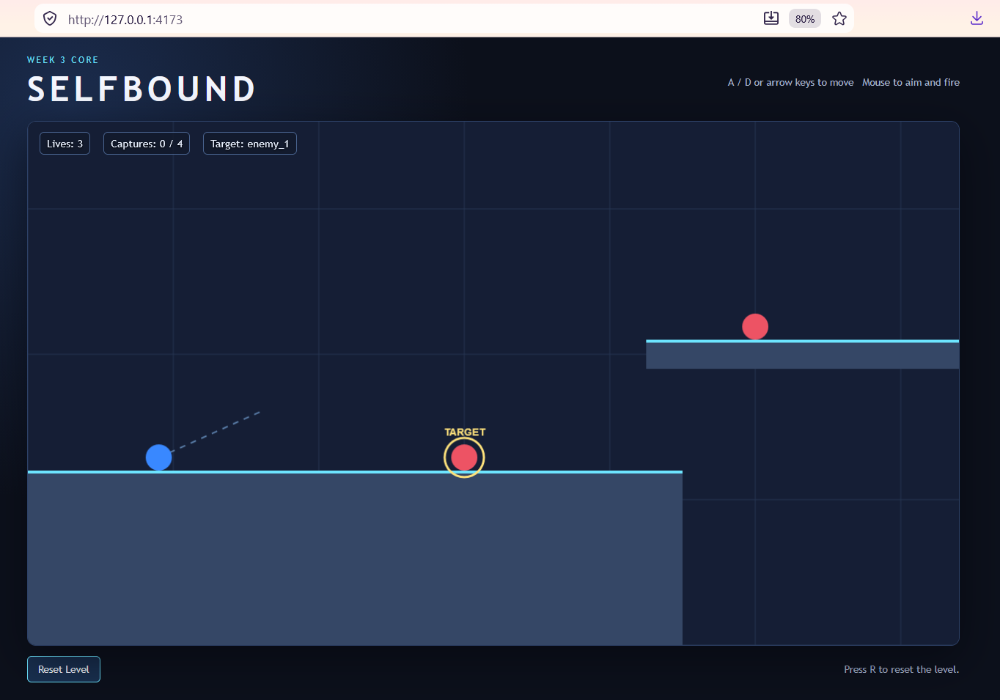

# EVIDENCE 003

This evidence records the Week 3 level change before the later frontend/backend split. At the time of the change, the level file was `src/level.ts`; its current path is [`frontend/src/level.ts`](../frontend/src/level.ts). The baseline reference remains the immutable `baseline-v1` tag.

## 1. Baseline Summary

### Initial Claim

The Week 3 Core should provide a small, deterministic 2D side-scroller in which the player's movement, projectile, enemy capture, green threat, reset, camera, and win conditions are all implemented within the defined scope, and in which the required capture sequence can be completed and the exit reached.

### Baseline Commit / Version

Git tag `baseline-v1` -> commit `7d6dc17` ("initial game"). The baseline is preserved and is not overwritten by the controlled change.

### Run Command

```text
npm start
```

### Baseline Environment / Actual Output

Windows, PowerShell, Firefox on the desktop, game served at `http://127.0.0.1:4173`.

```text
PS C:\Users\Milena\Documents\GitHub\SELFBOUND_Game> npm start

> selfbound-game@1.0.0 start
> npm run build && npm run serve

> selfbound-game@1.0.0 build
> tsc -p tsconfig.json

> selfbound-game@1.0.0 serve
> node scripts/serve.mjs

SELFBOUND running at http://127.0.0.1:4173
```

### Baseline Screenshot / Evidence



The initial state: blue player at spawn, HUD shows `Lives: 3`, `Captures: 0 / 4`, `Target: enemy_1`, target marker on `enemy_1`.

Baseline video: [fail_level.mp4](../fail_level.mp4) shows the baseline run in which the level cannot be completed.

## 2. Initial Test Status

| Check                 | Expected              | Actual                                                               | Status   |
| --------------------- | --------------------- | -------------------------------------------------------------------- | -------- |
| Application starts    | Browser app loads     | Loads at `127.0.0.1:4173`, canvas and HUD render                     | PASS     |
| Game loop runs        | Animation updates     | Player moves with A/D, aim line follows the mouse                    | PASS     |
| `npm test` (baseline) | Pure-logic tests pass | 5 pass, 0 fail                                                       | PASS     |
| Week 3 evals E1-E3    | See `EVALS.md`        | Work as expected                                                     | PASS     |
| Week 3 eval E4        | See `EVALS.md`        | `enemy_2` and `enemy_4` cannot be hit, the level cannot be completed | **FAIL** |

The failing E4 is the problem selected for the controlled change below. This table and `EVALS.md` state the same result.

## 3. Selected Problem

### 3.1 Claim

A player can capture every enemy of `requiredSequence` in order and then reach the exit. This is required by `GAME_SPEC.md` section 4 and by the Definition of Done ("the player can complete the required sequence and reach the exit").

### 3.2 Signal

1. Manual play in the browser: after capturing `enemy_1`, every shot aimed at `enemy_2` hits the left side of `middle-platform` and turns into a green threat. The HUD stays at `Captures: 1 / 4`. Recorded in [fail_level.mp4](../fail_level.mp4).
2. Headless check `node scripts/check-reachability.mjs`, which drives the real `Game` class and sweeps player positions and shot angles for every capture stage:

```text
PS C:\Users\Milena\Documents\GitHub\SELFBOUND_Game> node scripts/check-reachability.mjs
PASS  stage 0: enemy_1 from platform "start-ground" -> 7734 capturing shots { playerX: 18, angle: 1.5 }
FAIL  stage 1: enemy_2 from platform "start-ground" -> 0 capturing shots
PASS  stage 2: enemy_3 from platform "middle-platform" -> 17 capturing shots { playerX: 1818, angle: 18 }
FAIL  stage 3: enemy_4 from platform "lower-route" -> 0 capturing shots
RESULT: FAIL - requiredSequence cannot be completed
```

### 3.3 Problem

`enemy_2` and `enemy_4` stand on top of platforms that are higher than the platform the player stands on. The player cannot jump, so the only way up is a capture shot, but the edge of the target's own platform blocks every straight line of fire that is inside the 450-unit projectile range. The sequence stops at `1 / 4` and the win state is unreachable.

## 4. Hypothesis

The defect is in the Core Level 1 geometry, not in the collision, projectile or capture code. If `enemy_2`, `enemy_4` and the surrounding platforms are placed so that a line of fire from the player's platform clears the platform edge within the projectile range, every stage becomes capturable without changing any gameplay code.

## 5. Minimum Controlled Change

One change, level data only: [`frontend/src/level.ts`](../frontend/src/level.ts), which was `src/level.ts` when the change was made. No gameplay logic, collision, projectile, camera, validation, tests or `GAME_SPEC.md` changes were part of that controlled change.

Prompt used: [FIX_PROMPT_E4_1.md](FIX_PROMPT_E4_1.md).

Change applied to Core Level 1:

| Element             | Baseline                        | After change                    | Why                                                                                            |
| ------------------- | ------------------------------- | ------------------------------- | ---------------------------------------------------------------------------------------------- |
| `enemy_2`           | `x: 1000`                       | `x: 860`                        | moved next to the left edge of `middle-platform` so a shot from `start-ground` clears the edge |
| `middle-platform`   | `height: 40`                    | `height: 70`                    | thicker platform, so the shot at `enemy_2` must clear the edge instead of grazing it           |
| `lower-route`       | `x: 1700`                       | `x: 1940`                       | opens the line of fire from `middle-platform` down to `enemy_3`                                |
| `lower-route-block` | not present                     | `x: 1910, y: 950, 70 x 70`      | forces a deliberate shot toward `enemy_3` instead of a free straight line                      |
| `enemy_3`           | `radius: 18`                    | `radius: 23`                    | slightly larger target, since its shot is the narrowest one                                    |
| `enemy_4`           | `x: 2700`, patrol `2470 - 3130` | `x: 2303`, patrol `2303 - 2421` | patrols near the left edge of `upper-route`, inside projectile range from `lower-route`        |
| `bounce-cap`        | `x: 2300, y: 610`               | `x: 2250, y: 720`               | lowered and moved left so the bounce route toward `enemy_4` is usable                          |
| `bounce-wall`       | `x: 2550, y: 610, width: 40`    | `x: 2200, y: 610, width: 35`    | matches the new bounce-cap position                                                            |

`upper-route`, `start-ground`, `spawn`, `requiredSequence` and `exit` are unchanged.

Fix commit: `5109d5b` (`Fix level, improve readme file.`; includes the Core Level 1 geometry change).

## 6. Re-run the Same Evals

| ID                  | Baseline Result                                                             | After Change                                                                                                                                                                                              | Status |
| ------------------- | --------------------------------------------------------------------------- | --------------------------------------------------------------------------------------------------------------------------------------------------------------------------------------------------------- | ------ |
| E1                  | Player spawns, HUD shows 3 lives, movement works                            | Unchanged: player spawns, `Lives: 3`, `Captures: 0 / 4`, movement works                                                                                                                                   | PASS   |
| E2                  | One life lost, state reset, remaining lives preserved                       | Unchanged: one life lost per fall, state reset, remaining lives preserved                                                                                                                                 | PASS   |
| E3                  | Projectile captures the target, player teleports, progress +1               | Unchanged: capture teleports the player and progress increases by one                                                                                                                                     | PASS   |
| E4                  | `enemy_2` and `enemy_4` unreachable, `RESULT: FAIL`, level stuck at `1 / 4` | `RESULT: PASS - every target is capturable` (1071, 12 and 7419 capturing shots for stages 1-3); manual run reaches `Captures: 4 / 4` and `Level Complete`, recorded in [Base_game_demo.mp4](../Base_game_demo.mp4) | PASS   |
| E5 (camera bounds)  | Camera stayed clamped at every edge                                         | Unchanged: camera stays clamped at every edge                                                                                                                                                             | PASS   |
| E6 (invalid config) | `validateGameConfig` rejects the input with 3 errors, safe fallback used    | Unchanged: rejected with 3 errors, safe fallback used (`npm test`)                                                                                                                                        | PASS   |

The full manual browser runs are recorded in [BROWSER_SMOKE_BASELINE.md](BROWSER_SMOKE_BASELINE.md) and [BROWSER_SMOKE_AFTER.md](BROWSER_SMOKE_AFTER.md).

## 7. Commands Actually Run

Before the controlled change (baseline behaviour, gameplay code untouched):

```text
npm install
npm run typecheck          -> no errors
npm test                   -> tests 15, pass 15, fail 0
npm run build              -> no errors
node scripts/check-reachability.mjs
PASS  stage 0: enemy_1 from platform "start-ground" -> 7734 capturing shots { playerX: 18, angle: 1.5 }
FAIL  stage 1: enemy_2 from platform "start-ground" -> 0 capturing shots
PASS  stage 2: enemy_3 from platform "middle-platform" -> 17 capturing shots { playerX: 1818, angle: 18 }
FAIL  stage 3: enemy_4 from platform "lower-route" -> 0 capturing shots
RESULT: FAIL - requiredSequence cannot be completed
npm start                  -> SELFBOUND running at http://127.0.0.1:4173
```

After the controlled change (then `src/level.ts`, now [`frontend/src/level.ts`](../frontend/src/level.ts)):

```text
npm run typecheck          -> no errors
npm test                   -> tests 15, pass 15, fail 0
npm run build              -> no errors
node scripts/check-reachability.mjs
PASS  stage 0: enemy_1 from platform "start-ground" -> 7734 capturing shots { playerX: 18, angle: 1.5 }
PASS  stage 1: enemy_2 from platform "start-ground" -> 1071 capturing shots { playerX: 278, angle: 18 }
PASS  stage 2: enemy_3 from platform "middle-platform" -> 12 capturing shots { playerX: 1828, angle: 20 }
PASS  stage 3: enemy_4 from platform "lower-route" -> 7419 capturing shots { playerX: 1958, angle: 44 }
RESULT: PASS - every target is capturable
git diff --stat            -> .gitignore, docs/EVALS.md, docs/EVIDENCE_003.md, package.json,
                              src/level.ts, tsconfig.test.json
npm start                  -> SELFBOUND running at http://127.0.0.1:4173
```

The full test output of both runs is the 15-test list from `npm test` (10 gameplay tests plus 5 pure-logic tests), 15 pass and 0 fail in both cases.

## 8. Known Limitation

- `check-reachability.mjs` places the player on the platform under the previous capture point and samples a patrol enemy at 30 fixed positions. It proves that a capturing shot exists, not that it is comfortable for a human player.
- `enemy_3` remains the narrowest shot in the level: only 12 capturing shots in the whole sweep, from the right part of `middle-platform`. It is reachable, but a player has to aim carefully.
- The gameplay tests in `tests/gameplay.test.ts` run on a small synthetic level, so they verify the game rules, not the tuning of Core Level 1. Level tuning is covered by the reachability check and the manual browser runs.
- Running `node scripts/check-reachability.mjs` prints a Node `MODULE_TYPELESS_PACKAGE_JSON` warning because `package.json` has no `"type": "module"`. It is only a performance notice and does not affect the result; it was left unchanged so this commit stays limited to level data.
- Only Core Level 1 exists, so completing the sequence and the exit is verified on one level only.

## 9. Evidence Files

- baseline screenshot: [image.png](image.png)
- baseline video (level cannot be completed): [fail_level.mp4](../fail_level.mp4)
- after-change video (full run to `Level Complete`): [Base_game_demo.mp4](../Base_game_demo.mp4)
- browser smoke runs: [BROWSER_SMOKE_BASELINE.md](BROWSER_SMOKE_BASELINE.md), [BROWSER_SMOKE_AFTER.md](BROWSER_SMOKE_AFTER.md)
- reachability check: [`scripts/check-reachability.mjs`](../scripts/check-reachability.mjs) (output in sections 3, 6 and 7)
- automated tests: [`tests/logic.test.ts`](../tests/logic.test.ts), [`tests/gameplay.test.ts`](../tests/gameplay.test.ts)
- baseline reference: tag `baseline-v1`, commit `7d6dc17`
- fix commit: `5109d5b`

## 10. Contributions

### Pair Member A - Milena Paripović

Created the application with the coding agent from `BUILD_PROMPT_V1.md`; captured and preserved the baseline (`npm start` output, screenshot, tag `baseline-v1`); found and documented the editor-only TS2591 problem and its fix (Appendix A); added the reachability check `scripts/check-reachability.mjs` and the gameplay test suite `tests/gameplay.test.ts`; ran the baseline and after-change browser smoke runs and recorded the videos; wrote and aligned `EVIDENCE_003.md`, `EVALS.md`, `BROWSER_SMOKE_*.md`, `AI_USAGE_LOG.md` and `README.md`.

### Pair Member B - Dušan Nikolić

Proposed the game idea and did the initial project setup, consulting ChatGPT and Gemini during that phase; contributed to the specification documents; implemented the controlled change in the then-current `src/level.ts` (now [`frontend/src/level.ts`](../frontend/src/level.ts)) that made every target of `requiredSequence` reachable, and confirmed the reachability result.

---

## Appendix A - Secondary Fix (not the controlled change)

This editor-configuration fix was made before the controlled change. It is recorded here for completeness. It changes no gameplay behaviour and no eval result.

**Claim:** `tests/logic.test.ts` should compile cleanly both from the command line and in VS Code.

**Signal:** VS Code reported `TS2591: Cannot find name 'node:test'` on the imports, while `npm test` passed with 5/5.

**Hypothesis:** `npm test` compiles with `tsconfig.test.json` (which has `"types": ["node"]`), but VS Code falls back to `tsconfig.json`, which excludes `tests/` and has `"types": []`.

**Minimum change:** added `tests/tsconfig.json` with `{ "extends": "../tsconfig.test.json" }`. No dependency added.

**Check and result:** `npx tsc -p tests/tsconfig.json --noEmit` -> no errors; `npm test` -> 5 pass, 0 fail (unchanged); `npm run typecheck` -> no errors; the editor error is gone after reloading the window.

**Limitation:** tooling only. It does not affect any gameplay eval, which is why it is not used as the controlled change for E4.

## Week 4 AI Coach browser integration addendum

**Claim:** after a completed Game Over run, the enabled AI Coach control sends validated completed-run history to the local backend and displays the returned advice.

**Signal:** with the documented combined `npm run dev` workflow, a headless Edge browser reached Game Over after three lost lives and enabled AI Coach, but clicking it showed the safe unavailable message. Before the fix, the browser debugger reported `TypeError: Failed to execute 'fetch' on 'Window': Illegal invocation`; the network trace contained no Coach request. The archived request snapshot itself passed the frontend runtime validator.

**Problem:** `AiCoachClient` invoked the native `fetch` function as `this.fetcher(...)`, binding `this` to the client instance. Browser `fetch` requires the global `Window` receiver, so it rejected before any network request. The backend, CORS policy, duplicated request contracts, fake provider, and response validator were not the failing boundary.

**Hypothesis:** calling the transport with `globalThis` as its receiver will allow the normal browser request while retaining all existing request and response validation.

**Minimum change:** `frontend/src/ai-coach-client.ts` now calls `this.fetcher.call(globalThis, ...)`. A regression test in `tests/ai-coach.test.ts` asserts the transport receiver.

**Check and result:** `npm test` passed 39/39; `npm run typecheck`, `npm run build`, and `node scripts/check-reachability.mjs` passed. Under `npm run dev`, headless Edge observed zero Coach POSTs with no history; after Game Over it sent `POST http://127.0.0.1:3001/api/ai/coach` from `http://127.0.0.1:4173`, received CORS preflight 204 and Coach response 200, and rendered deterministic advice. After terminal reset, an active run fired a shot and created a green threat, while the next request still contained exactly the one archived run. A 503 response rendered the generic unavailable message. Invalid-request/provider-zero-call behavior and provider-failure mapping also passed in the backend tests.

**Limitation:** the browser check was headless and verified behavior/network traffic, not visual layout or keyboard focus. No Gemini or live provider was used. The successful 200 response came from the default `FakeAiCoachProvider`.

## Week 4 Gemini API-path diagnosis addendum (2026-09-28)

**Claim:** the earlier minimal SDK Interactions timeout cannot be attributed to SELFBOUND telemetry, prompt, or structured output. The final comparison establishes that both API paths can respond in this environment, but does not establish the cause of the earlier stall.

**Signal:** exactly two generation requests were issued outside the network-restricted sandbox, using the environment-loaded credential, the configured `gemini-3.5-flash-lite`, input `Reply with OK`, one HTTP attempt per stage, and 30-second diagnostic deadlines. No SELFBOUND prompt, schema, tools, or telemetry were included. Only metadata was printed.

| Stage | Started | Elapsed | HTTP status | Result | HTTP attempts |
|---|---|---|---|---|---|
| A: Node built-in fetch, POST `/v1beta/interactions`, `store:false` | Yes | 8,153 ms | 200 | Completed | 1 |
| B: SDK 2.24.0 `models.generateContent`, request-level `config.httpOptions.retryOptions.attempts:1` | Yes | 18,361 ms | 200 | Text generated | 1 |

**Problem:** both minimal requests exceeded the production 7-second attempt deadline. Separately, the production Interactions adapter supplied `generation_config.temperature` despite its absence from the installed generation schema/API reference, and client `httpOptions.retryOptions` did not disable the generated Interactions client's default retries.

**Hypothesis:** latency variability or an execution/network-path difference can account for the earlier minimal SDK timeout; this comparison cannot distinguish them. The two configuration mismatches are independently confirmed defects, but neither was present in the earlier minimal diagnostic, so they do not explain that timeout.

**Minimum change:** remove `temperature`; pass `retries: { strategy: "none" }` directly to `interactions.create`. Preserve Interactions, model, stateless schema, contracts, fake provider, 7,000 ms per attempt, maximum two attempts, and 500 ms retry delay. Add an optional HTTP transport seam for offline SDK tests. Delete the temporary diagnostic script after the two calls.

**Check:** inspect SDK 2.24.0 request construction/options and compare the actual outgoing production request through an offline transport. Verify its endpoint, exact body, output/usage extraction, cancellation, and effective HTTP attempt counts. Run `npm test`, `npm run typecheck`, and `npm run build`.

**Result:** all 55 offline tests passed, including four new real-SDK transport-double regressions. Typecheck and build passed. The outgoing production request uses the same documented `/v1beta/interactions` endpoint, with the intentional Coach prompt/schema/output-cap additions. No further request-shape or AbortSignal defect was found. Request-level retry suppression now enforces one HTTP attempt per SDK call and at most two through the Coach wrapper. No production timeout increase or switch to `generateContent` was made or recommended from these two samples; `generateContent` was slower here.

**Limitation:** one success per path is not a latency distribution or a live Coach validation. The current SDK Interactions path was inspected offline, not reissued live, because the two-call limit was exhausted. The preceding timeout and these successes occurred at different times; their execution conditions are not a controlled comparison. No explicit provider error was returned in this diagnostic. A larger timeout might accommodate these measured minimal calls, but these observations do not establish an appropriate production Coach budget. Successful live structured Coach advice remains unverified.

**Final checks:** `node scripts/check-reachability.mjs` passed all four stages (`RESULT: PASS - every target is capturable`); `git diff --check` found no whitespace errors. The existing Node module-type warning and Git line-ending notices were emitted. `.env` is ignored and untracked with no history for that path; the example contains an empty key; a frontend source/build scan found no provider credential/SDK/auth wiring. No credential-value search or exhaustive historical secret audit was performed.

References: [Interactions REST endpoint and generation schema](https://ai.google.dev/api/interactions-api), [API overview and authentication example](https://ai.google.dev/gemini-api/docs/interactions-overview). The overview still mentions temperature generically; the API reference and installed Interactions schema omit it, so the adapter follows the latter.

## Week 4 full structured REST Coach diagnostic (2026-09-28)

**Claim:** a successful minimal REST request does not yet establish that the full structured Coach workload completes within a usable deadline.

**Signal:** one direct Node built-in `fetch` POST to the documented `/v1beta/interactions` endpoint used `gemini-3.5-flash-lite`, the actual production request builder (system instruction, response schema, `store:false`, and 512-token cap), and one synthetic Game Over summary accepted by `validateAiCoachRequest`. The script did not instantiate or call the SDK. It consumed the environment-loaded key only for authentication, disabled redirects, made no retry, and applied a 30-second deadline through response processing.

**Problem:** the request hit the deadline in **30,015 ms**, before receiving an HTTP status. Envelope/advice JSON parsing and authoritative `validateAiCoachAdvice` validation could not run. Safe result: `timeout`; no response category or token usage was available. Exactly **one live generation request** was made in this task.

**Hypothesis:** latency or an intermittent transport/provider stall remains possible. This single full-workload failure, compared with earlier minimal successes at different times, does not isolate prompt, schema, transport, or provider latency as the cause.

**Minimum change:** no production change in this task. The requested REST migration was conditional on successful runtime-validated advice, which was not obtained. Keep the existing SDK Interactions adapter and its 7,000 ms per-attempt / maximum two attempts / 500 ms delay policy pending evidence. A new 15–20 second budget cannot be selected from this unsuccessful full-workload measurement. Do not infer full `generateContent` compatibility or latency from its earlier minimal success. No production-path live validation was performed, and no further generation call was made. The temporary diagnostic script was removed.

**Check/result:** diagnostic output contained only HTTP-status availability, elapsed time, parsing/validation flags, fixed failure category, and call count. It excluded prompts, telemetry payloads, raw responses/errors, authentication headers, environment contents, and credential values. The agent did not inspect the real environment file or credential value.

**Limitation:** neither the full REST Coach workload nor the production SDK Coach path has successful live validation. The reason for the 30-second stall remains unresolved. The seven-second production policy is known to exclude the earlier 8,153 ms minimal REST success; retaining it here records the unchanged implementation, not a claim that it is adequate. Offline checks are recorded in the corresponding EVALS addendum.

## Week 4 GenerateContent model viability result (2026-09-28)

**Claim:** the full structured Coach workload is viable with `gemini-3.1-flash-lite` through installed SDK 2.24.0 `models.generateContent`, based on one successfully validated live sample.

**Signal:** one request using the real production system instruction and Coach schema, a synthetic completed run accepted by the backend validator, no tools, and a 512-token output cap returned HTTP 200 in **6,420 ms**. JSON parsing and `validateAiCoachResponse({ advice })` both passed. Primary category: `threat_management`. Reported tokens: 550 input, 210 output, 760 total. Exactly one HTTP attempt; no Interactions request or other model was tested in this task.

**Problem/hypothesis:** the previous full Interactions request stalled beyond 30 seconds. Changing both model and API in this authorized test establishes an available working combination but does not isolate the cause of the previous stall.

**Minimum proposed change:** migrate the backend provider to `models.generateContent` with explicit Week 4 model `gemini-3.1-flash-lite`, retaining the existing provider interface, fake provider, prompt semantics, contracts, validators, frontend behavior, and safe failures. Use a **15,000 ms total operation deadline**, including any retry delay and second attempt. This gives about 8.6 seconds of headroom over the measured 6.42 seconds without doubling the total wait on timeout. Do not retry after the local deadline; permit at most two attempts for explicit transient network/provider failures inside the remaining budget. This is a recommendation only; no production migration was made.

**Check/result:** structured output used documented GenerateContent `config.responseMimeType` plus `config.responseJsonSchema`; request-level `httpOptions.retryOptions.attempts:1` disabled retries, and a transport counter prevented any second HTTP call. GenerateContent has no supported `store` parameter, so none was sent. No conversation history, cache identifier, or tools were configured. This does not assert a provider-wide data retention policy. The 30-second AbortSignal/deadline covered generation and validation. The temporary diagnostic was removed; no offline checks were run because production/source files were unchanged in this task.

**Limitation:** one live sample proves viability, not a latency distribution, repeatability, advice quality across cases, or production integration. The current production SDK Interactions path remains unchanged. No real environment-file contents or credential value was inspected by the agent, and output contained only safe metadata.

## Week 4 GenerateContent production migration (2026-09-29)

**Claim:** production AI Coach now uses the API/model combination that passed the full structured viability check, while preserving the public Coach contracts and bounding retries within one total deadline.

**Signal:** the previous viability call completed the full structured workload in 6,420 ms with valid JSON, authoritative response validation, category `threat_management`, and 550 input / 210 output / 760 total tokens. The migrated production provider subsequently completed one limited live Coach request in 2,593 ms, with one provider/HTTP attempt, runtime validation passed, category `threat_management`, and 531 input / 197 output / 728 total tokens.

**Problem:** the then-current production Interactions route and 7,000 ms per-attempt policy did not match the known successful full structured path and could permit almost 15 seconds plus routing overhead across two attempts. One viability sample does not establish a latency distribution.

**Hypothesis:** Gemini Developer API `models.generateContent` with `gemini-3.1-flash-lite` supports the established Coach prompt/schema and completes the bounded request within a 15-second total deadline in this environment. The live migration call supports viability; it does not establish a percentile or guarantee.

**Minimum change:** switched only the backend Gemini adapter/configuration to `models.generateContent` and `gemini-3.1-flash-lite`; retained the production system instruction, bounded summaries, output schema, validators, backend endpoint, fake provider, and public request/response contracts. Replaced the per-attempt timeout with a monotonic 15,000 ms total deadline, two maximum provider attempts, 500 ms retry delay, and at least 1,000 ms useful attempt budget after that delay. SDK retries are set to one HTTP request per adapter call.

**Check:** `npm test`; `npm run typecheck`; `npm run build`; `node scripts/check-reachability.mjs`; `git diff --check`; offline real-SDK HTTP doubles for exact GenerateContent request fields, response/usage extraction, cancellation, one request per SDK call, maximum two HTTP calls, retryable/non-retryable statuses, invalid local input, malformed output, and shared deadline. Then one limited live production-path validation.

**Result:** PASS. `npm test`: 55 passed, 0 failed. Typecheck and build passed. Reachability returned `RESULT: PASS - every target is capturable` with the existing Node module-type warning. `git diff --check` passed with Git line-ending notices. The live production-path call passed in 2,593 ms with one attempt, valid response, `threat_management`, 531 input / 197 output / 728 total tokens. An initial runner invocation failed local configuration validation before a provider call; the one actual live request ran with the intended backend provider/model process settings. No further live request was made.

**Limitation:** the current live call and the earlier 6,420 ms viability sample are two observations, not a latency distribution or advice-quality evaluation. No browser visual/focus play-test was performed as part of this migration. No `.env` contents or credential value were inspected, printed, or searched; the live runner emitted only safe metadata. No raw advice, telemetry, provider response, error, or authorization material was recorded.
